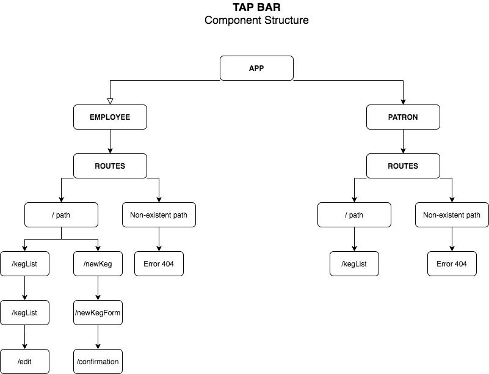

## TAP ROOM
##### by _**Uriel Gonzalez**_

### Description
A React program where a brewery management can manage their keg inventory.

### Component Structure

--
### Installation
```
* In command line, run the following:
* 1.Clone this repository
* $ git clone https://github.com/Ugonz86/TapRoom.git
* 2. Install dependencies
* $ npm install
* 3. Run program
* $ npm run start
* 4. Open webpage
* $ In your browser, go to http://localhost:8080
```
### Specs
```
As a patron, I want to see a list/menu of all available kegs. For each keg, I need to see it's name, brand, price and alcoholContent (or perhaps something like flavor for a kombucha store).

As an employee, I want to fill out a form when I tap a new keg to add it to the list. (Don't worry about authenticating employee user accounts yet.)

As an employee, I want the option to edit a keg's properties after entering them just in case I make a mistake.

As a patron and/or employee, I want to see how many pints are left in a keg. (Hint: A full keg has roughly 124 pints).

As an employee, I want to be able to click a button next to a keg whenever I sell a pint of it. This should decrease the number of pints left by 1.

As an employee, I want to be able to see kegs with less than 10 pints left so I can be ready to change them.

As a patron, I want to have kegs prices to be color-coded for easy readability. Perhaps based on their price (greater or less than $5 per pint, perhaps) or the particular style of beer or kombucha.

As a patron, I want to use the alcohol content property to display stronger beers differently than weaker beers.
```

### Known Bugs
* No known bugs at this moment

### Technologies Used
* Git, GitHub, ReactJS & Webpack

### Support and Contact Details
* _ugonzalez86@gmail.com_

### Licence
Copyright © 2020
MIT Licence